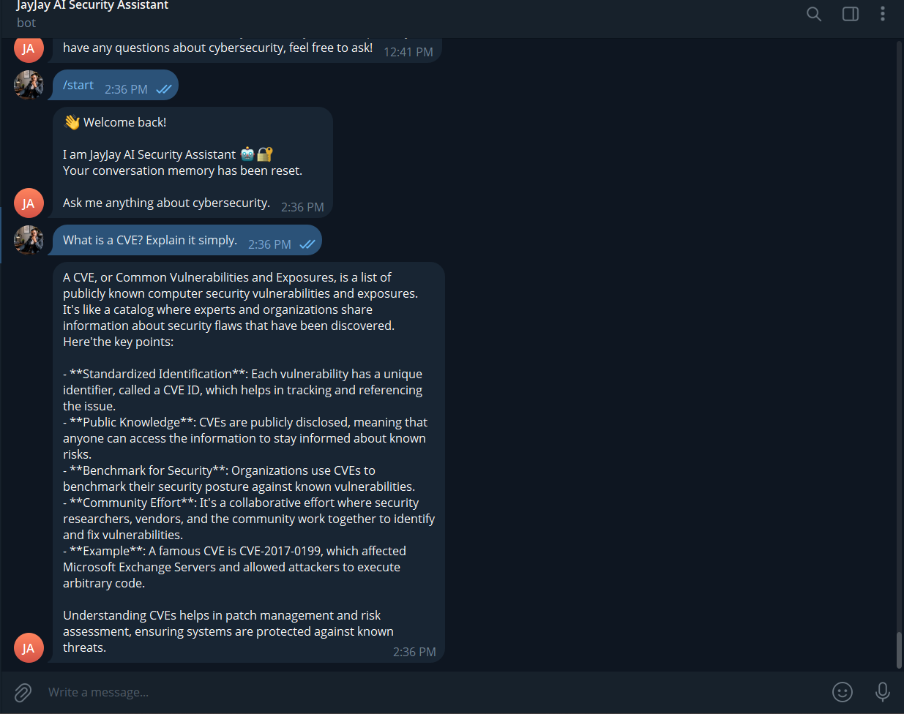
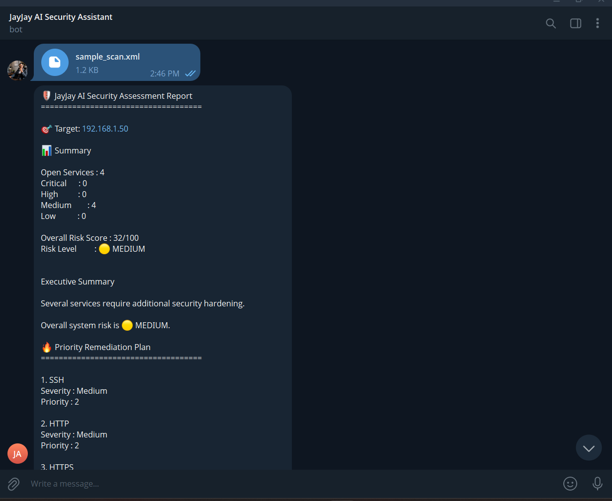
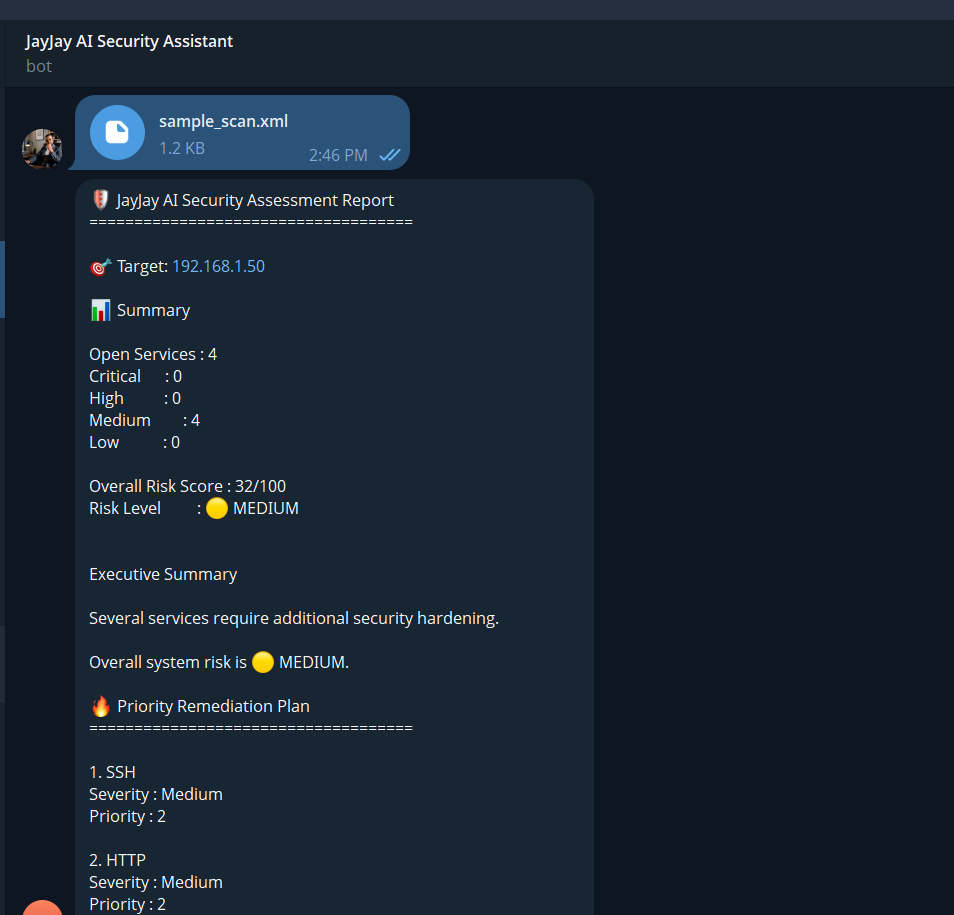
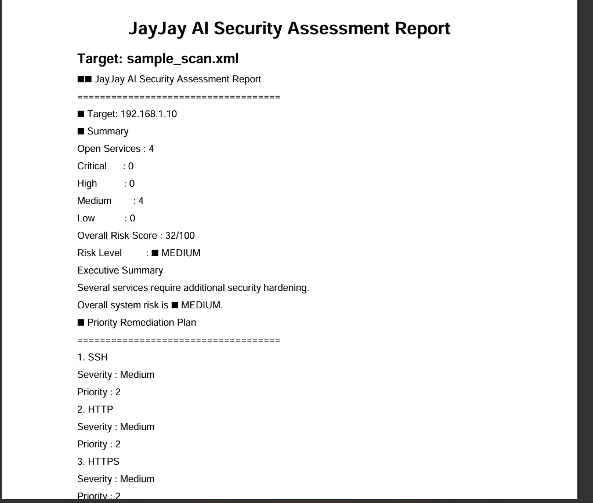

# 🛡️ JayJay AI Security Assistant

> **AI-Powered Local Cybersecurity Assistant for Defensive Security Operations**

JayJay AI Security Assistant is a Python-based cybersecurity automation project that combines a local Large Language Model (LLM), Telegram, vulnerability intelligence, Nmap XML analysis, risk assessment, conversation memory, security logging, system health monitoring, and automated PDF security reporting.

The system uses **Ollama** to run AI inference locally with **Microsoft Phi-3 Mini**, providing a privacy-focused cybersecurity assistant without depending on cloud-based AI inference.

---

## 🎯 Project Overview

JayJay AI Security Assistant was developed as a practical cybersecurity and AI automation project focused on defensive security operations.

The assistant provides:

- 🤖 AI-powered cybersecurity assistance
- 🔎 Vulnerability and CVE intelligence
- 📡 Nmap XML scan analysis
- 📊 Security risk assessment
- 🛡️ Remediation recommendations
- 📑 Automated PDF security reports
- 💾 Conversation memory
- 🔐 Authorized-user access control
- 📝 Security event logging
- 🩺 System health monitoring
- ⚠️ Defensive error handling

The project demonstrates how **Python, cybersecurity intelligence, local LLMs, automation, and Telegram** can be integrated into a practical security-assistance platform.

---

## 🚀 Key Features

### 🤖 AI Cybersecurity Assistant

- Telegram-based cybersecurity assistant
- Local AI inference through Ollama
- Microsoft Phi-3 Mini LLM
- Cybersecurity-focused responses
- Conversation memory
- Defensive security guidance

### 🔎 CVE & Vulnerability Intelligence

The assistant integrates vulnerability intelligence into security analysis.

Capabilities include:

- CVE identification
- CVE metadata
- CVSS severity information
- Vulnerability descriptions
- Security impact information
- Remediation recommendations
- Risk-oriented analysis

### 📡 Nmap XML Analysis

The assistant can process Nmap XML scan results and convert them into structured security assessments.

The analysis pipeline is:

```text
Nmap XML Scan
      │
      ▼
XML Parser
      │
      ▼
Scan Data Converter
      │
      ▼
Security Analysis
      │
      ▼
CVE Intelligence
      │
      ▼
Risk Assessment
      │
      ▼
Remediation Recommendations
      │
      ▼
Security Report
```

### 📊 Security Risk Assessment

The system evaluates discovered services and security findings using severity-based risk assessment.

The assessment includes:

- Critical findings
- High-risk findings
- Medium-risk findings
- Low-risk findings
- Overall risk score
- Overall risk level
- Priority remediation recommendations

### 📑 Automated PDF Security Reports

Security assessments can be converted into professional PDF security reports.

Reports can contain:

- Assessment summary
- Target information
- Risk score
- Risk level
- Security findings
- Vulnerability information
- Remediation recommendations

### 🔐 Security Controls

The project includes defensive security controls such as:

- Authorized-user verification
- Environment-based secret configuration
- Security event logging
- Safe error handling
- XML validation
- Defensive-only security guidance

### 🩺 Health Monitoring

The project includes startup health checks that verify:

- Telegram Bot Token configuration
- AI provider configuration
- Ollama server availability
- Required AI model availability

Example:

```text
========================================
🛡️ JayJay AI Security Assistant
========================================
✅ Telegram Bot Token: Loaded
✅ AI Provider: ollama
✅ Ollama Server: Online
✅ Model Installed: phi3:mini
========================================

🤖 JayJay AI Security Assistant is running...
```

---

## 📸 Project Screenshots

### 🤖 Telegram AI Security Assistant

The Telegram interface provides the primary interaction layer for cybersecurity questions, security guidance, and automated analysis.



---

### 📡 Nmap XML Security Analysis

The assistant processes Nmap XML scan results and produces structured security findings, vulnerability intelligence, risk assessment, and remediation recommendations.



---

### 🔎 Detailed Nmap Security Findings

The analysis provides detailed service information, identified vulnerabilities, CVE intelligence, severity information, and recommended remediation actions.



---

### 📑 Automated Security Report

Security assessments can be converted into professional PDF security reports containing assessment summaries, risk information, findings, and remediation recommendations.



---

## 🏗️ System Architecture

```text
                    ┌──────────────────────┐
                    │      Telegram        │
                    │     User Interface   │
                    └──────────┬───────────┘
                               │
                               ▼
                    ┌──────────────────────┐
                    │    Telegram Bot      │
                    │   Python Application │
                    └──────────┬───────────┘
                               │
                ┌──────────────┼──────────────┐
                │              │              │
                ▼              ▼              ▼
        ┌─────────────┐ ┌─────────────┐ ┌─────────────┐
        │   Local AI  │ │   Nmap XML  │ │  Security   │
        │   Ollama    │ │   Analysis  │ │  Controls   │
        │  Phi-3 Mini │ │             │ │  & Logging  │
        └──────┬──────┘ └──────┬──────┘ └─────────────┘
               │               │
               │               ▼
               │      ┌──────────────────┐
               │      │ CVE Intelligence │
               │      │ & Risk Assessment│
               │      └────────┬─────────┘
               │               │
               └───────┬───────┘
                       ▼
              ┌────────────────────┐
              │ Security Reporting │
              │   PDF Generation   │
              └────────────────────┘
```

---

## 🔄 Security Analysis Workflow

```text
User
 │
 ▼
Telegram Bot
 │
 ├──────────────► AI Cybersecurity Questions
 │                       │
 │                       ▼
 │                  Ollama / Phi-3 Mini
 │
 └──────────────► Nmap XML Upload
                         │
                         ▼
                    XML Parser
                         │
                         ▼
                   Scan Converter
                         │
                         ▼
                  Security Analysis
                         │
                         ▼
                  CVE Intelligence
                         │
                         ▼
                   Risk Assessment
                         │
                         ▼
               Remediation Guidance
                         │
                         ▼
                  PDF Security Report
```

---

## 🛠️ Technology Stack

| Technology | Purpose |
|---|---|
| 🐍 Python 3 | Core application and automation |
| 🤖 Ollama | Local LLM inference |
| 🧠 Phi-3 Mini | Local cybersecurity AI model |
| 📱 Telegram Bot API | User interaction interface |
| 🔎 Nmap | Network security scanning |
| 📡 Nmap XML | Structured scan input |
| 🛡️ CVE Intelligence | Vulnerability identification and metadata |
| 📊 Risk Engine | Security severity and risk assessment |
| 📑 ReportLab | Automated PDF security reports |
| 🐧 Ubuntu 24.04 / WSL | Development environment |
| 🔐 Git & GitHub | Version control and project management |

---

## 📂 Project Structure

```text
JayJay-AI-Security-Assistant/
│
├── ai_engine.py
├── bot.py
├── config.py
├── handlers.py
├── health_check.py
├── logger.py
├── memory.py
├── security.py
├── requirements.txt
│
├── commands/
│   ├── analyze.py
│   ├── analyze_xml.py
│   └── report.py
│
├── intelligence/
│   ├── cve_lookup.py
│   ├── live_lookup.py
│   ├── local_database.py
│   ├── nvd.py
│   ├── parser.py
│   └── risk_engine.py
│
├── parser/
│   ├── converter.py
│   └── nmap_xml.py
│
├── reports/
│   └── pdf_report.py
│
├── docs/
│   └── screenshots/
│       ├── telegram-assistant.png
│       ├── nmap-xml-analysis.png
│       ├── nmap-xml-analysis2.png
│       └── security-report.png
│
├── generated_reports/
├── uploads/
├── sample_scan.xml
├── README.md
├── LICENSE
└── .gitignore
```

---

## 🔐 Security & Privacy

JayJay AI Security Assistant is designed for authorized defensive cybersecurity use.

Security considerations include:

- 🔒 AI inference is performed locally through Ollama.
- 🔑 Sensitive configuration is loaded through environment variables.
- 👤 Telegram access is restricted to authorized users.
- 📝 Security-related events are recorded through application logging.
- 🛡️ The assistant provides defensive cybersecurity guidance.
- ⚠️ Uploaded Nmap XML files are validated before analysis.
- 🚫 Secrets and local runtime files are excluded from version control through `.gitignore`.

---

## 🧪 Validation & Quality Checks

The project has been validated through functional and defensive testing, including:

- ✅ Python syntax compilation
- ✅ Git whitespace validation
- ✅ Ollama connectivity verification
- ✅ AI model availability verification
- ✅ Nmap XML analysis
- ✅ CVE intelligence processing
- ✅ Security risk assessment
- ✅ PDF report generation
- ✅ Invalid XML handling
- ✅ Missing-file error handling
- ✅ Telegram bot startup verification

Example startup validation:

```text
========================================
🛡️ JayJay AI Security Assistant
========================================
✅ Telegram Bot Token: Loaded
✅ AI Provider: ollama
✅ Ollama Server: Online
✅ Model Installed: phi3:mini
========================================

🤖 JayJay AI Security Assistant is running...
```

---

## 📈 Project Status

### Current Status

**Functional defensive cybersecurity assistant**

Implemented capabilities include:

- ✅ Telegram AI assistant
- ✅ Local Ollama integration
- ✅ Phi-3 Mini support
- ✅ Conversation memory
- ✅ Authorized-user controls
- ✅ Security logging
- ✅ Health monitoring
- ✅ CVE intelligence
- ✅ Nmap XML processing
- ✅ Security risk assessment
- ✅ Automated PDF reporting
- ✅ XML error handling
- ✅ Professional project documentation
- ✅ Project screenshots

---

## 🛣️ Future Development

Potential future improvements include:

- 🔎 Expanded threat intelligence integrations
- 🧠 AI inference performance optimization
- 📊 Advanced security dashboards
- 🛡️ MITRE ATT&CK mapping
- 🔍 IOC analysis
- 📈 Historical security assessment tracking
- ⚙️ Additional automation workflows
- 🧪 Expanded automated testing
- 🚀 Production deployment improvements

---

## 👨‍💻 Developer

**Jhay Jhay**

Cybersecurity Analyst | SOC Analyst | AI Automation | Python Developer

GitHub:

https://github.com/jhayjhaytechlinux

---

## 📄 License

This project is released under the **MIT License**.
